<p align="center">
  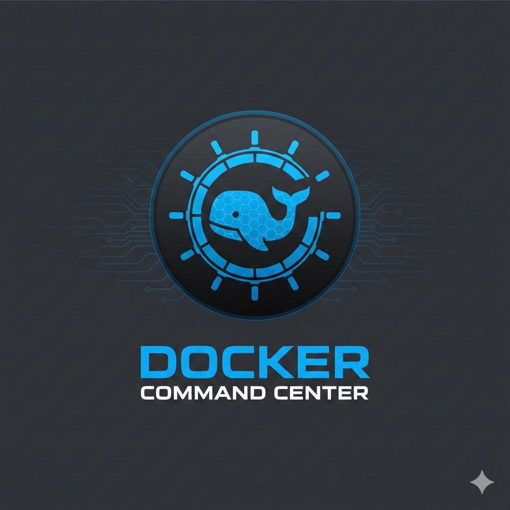
</p>

<h1 align="center">Docker Command Center</h1>

<p align="center">
  <strong>A next-generation Docker management platform — CLI-first, zero lock-in, real-time control.</strong>
</p>

<p align="center">
  
  
  
  
  
  
</p>

<p align="center">
  <video src="assets/showcase-demo.mp4" width="800" controls>
    Your browser does not support the video tag.
  </video>
</p>

---

## Screenshots

### Dashboard & Real-time Metrics

<p align="center">
  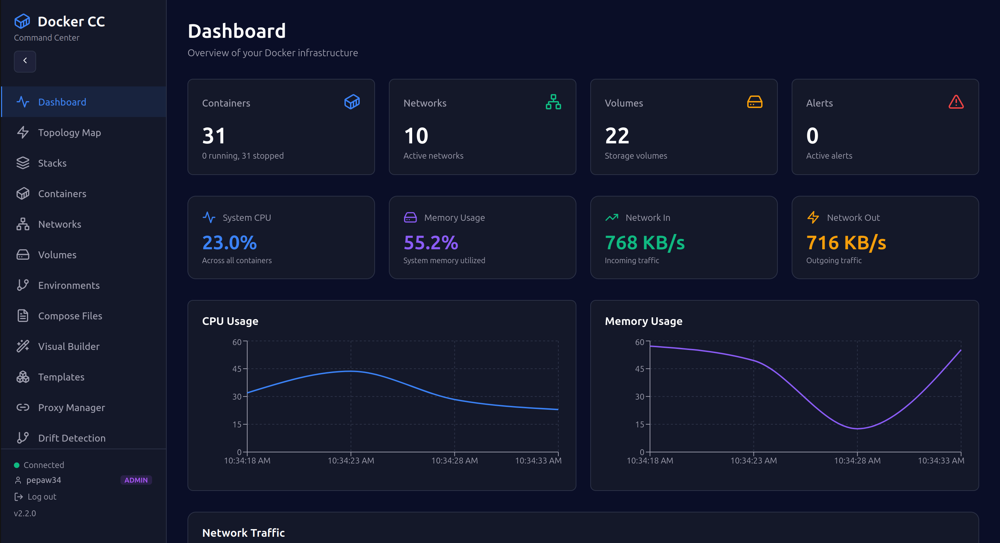
</p>

### Container Topology Map

<p align="center">
  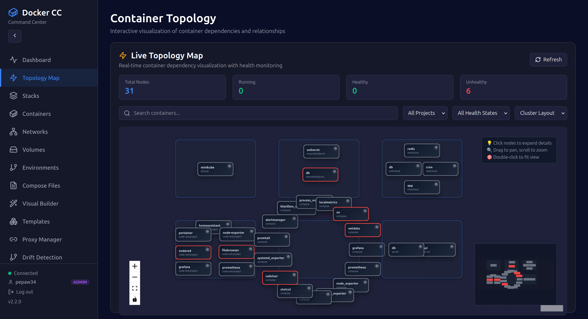
</p>

<table>
  <tr>
    <td>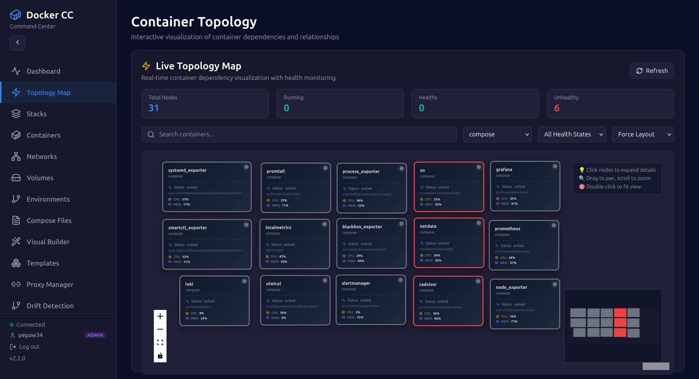</td>
    <td>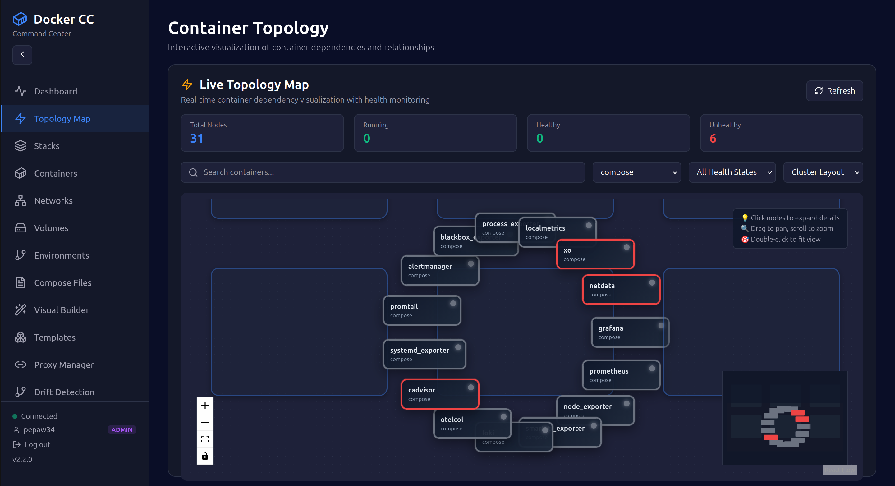</td>
  </tr>
  <tr>
    <td>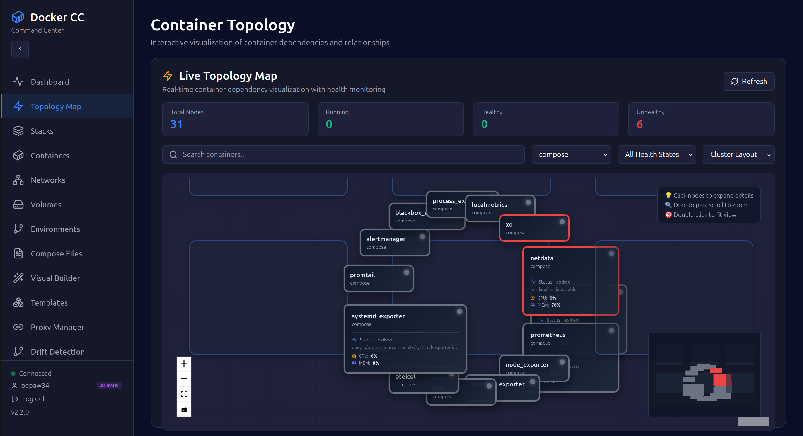</td>
    <td>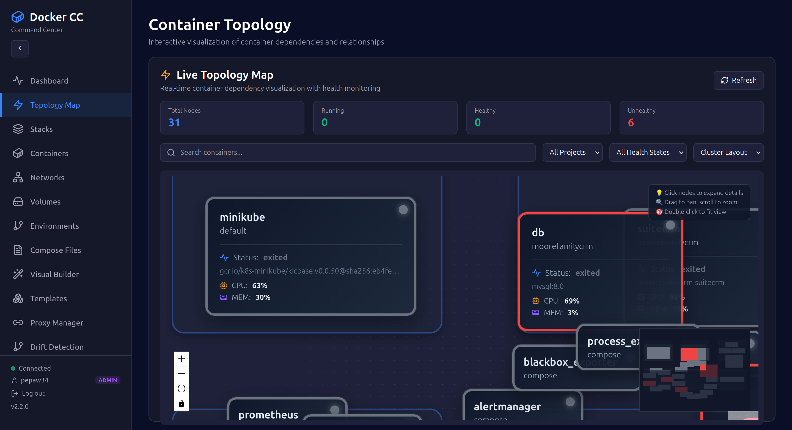</td>
  </tr>
</table>

### Compose Files Editor

<p align="center">
  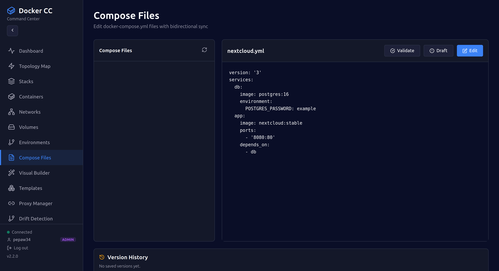
</p>

### Admin Panel

<table>
  <tr>
    <td>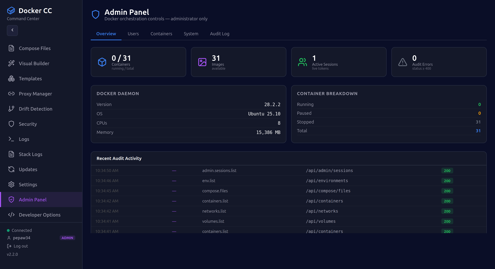</td>
    <td>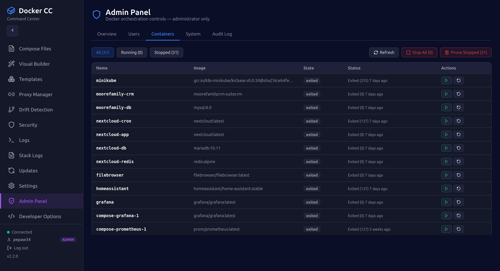</td>
  </tr>
  <tr>
    <td>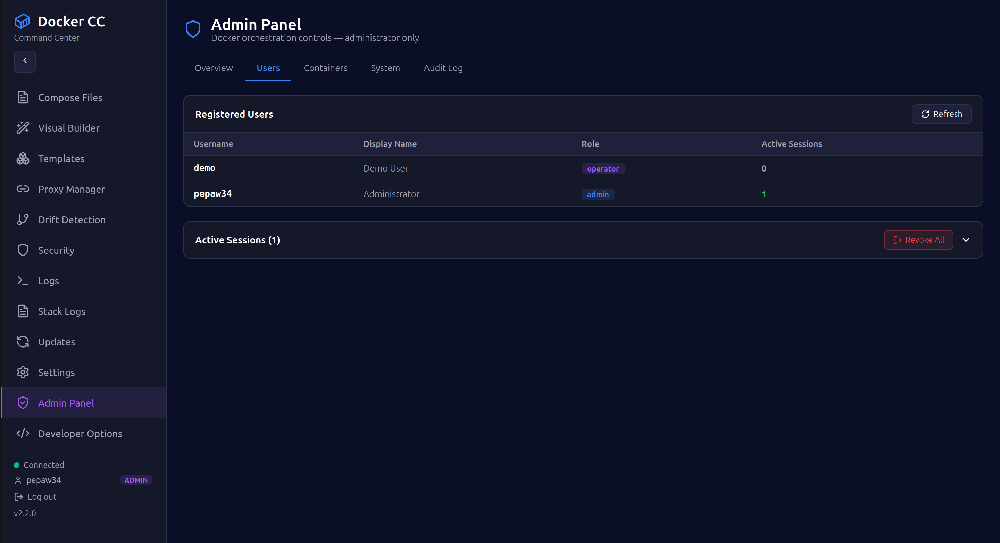</td>
    <td>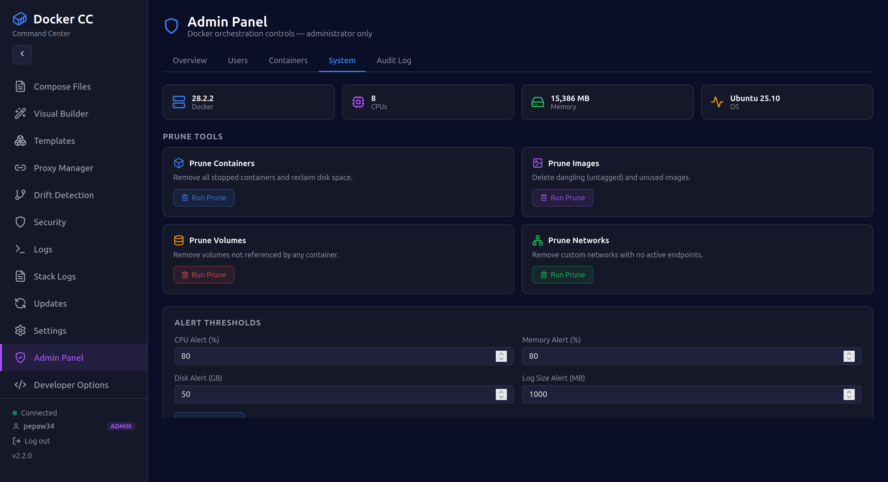</td>
  </tr>
</table>

### Developer Options (Admin Only)

<table>
  <tr>
    <td>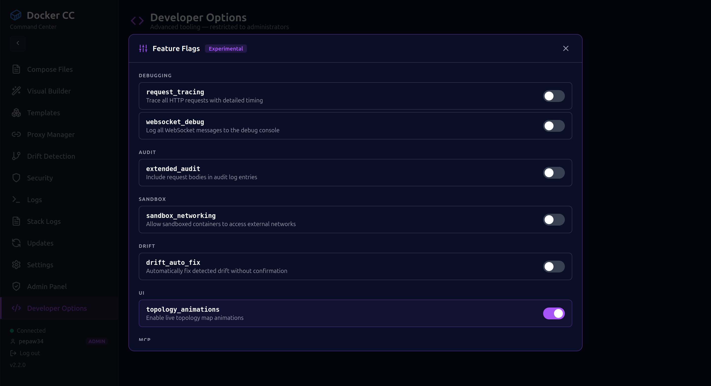</td>
    <td>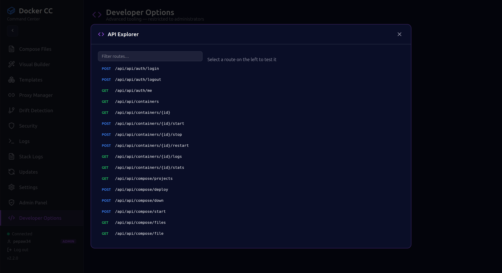</td>
  </tr>
  <tr>
    <td colspan="2">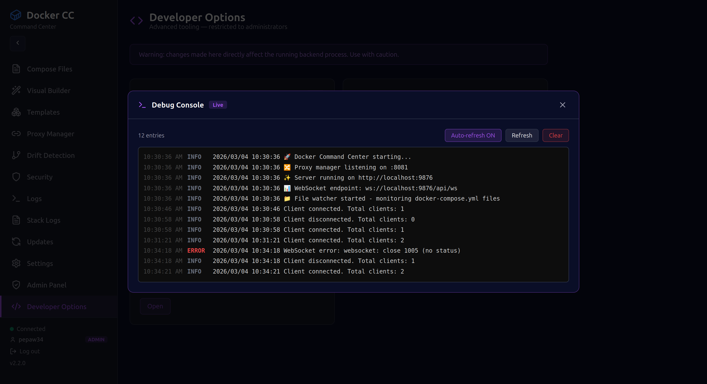</td>
  </tr>
</table>

---

## Overview

Docker Command Center (DCC) solves the friction of tools like Portainer and Docker Desktop with a **single self-contained binary** that embeds the full React frontend. No Docker container required to run the manager itself — clone, build, and go.

**Key differentiators:**
- Single binary (~14 MB) — zero external runtime dependencies
- Zero proprietary database — bidirectional sync with your `docker-compose.yml` files
- Real-time WebSocket updates across all 21 UI pages
- Built-in session-based authentication with role-based access control
- AI-ready via Model Context Protocol (MCP) Gateway
- CVE security scanning via Trivy integration
- Full audit trail with per-user action logging

---

## Quick Start

### Prerequisites

| Tool | Version |
|------|---------|
| Docker Engine | 20.10+ |
| Go | 1.24+ |
| Node.js | 18+ |

### Build & Run

```bash
# Clone
git clone https://github.com/paulmmoore3416/docker-command-center.git
cd docker-command-center

# Build frontend + embed into single binary
make build

# Run
./dcc
```

Open **http://localhost:9876** in your browser.

**Default credentials:**

| Username | Password | Role |
|----------|----------|------|
| `demo` | `demo123` | operator |
| `admin` | *(set via env)* | admin |

### Install system-wide

```bash
make install   # builds and copies to /usr/local/bin/dcc
dcc            # run from anywhere
```

See [GCP_DEPLOY.md](GCP_DEPLOY.md) for cloud deployment instructions.

---

## Features

### Core Features

| # | Feature | Description |
|---|---------|-------------|
| 1 | **Ghost Mode** | Bidirectional sync between UI and `docker-compose.yml` — no proprietary DB |
| 2 | **Smart Restarts** | Dependency-aware orchestration with health-check propagation |
| 3 | **Ephemeral Environments** | One-click branch stacks from Git with TTL-based auto-cleanup |
| 4 | **Visual Networking** | Live traffic canvas with container communication visualization |
| 5 | **Resource Guardrails** | CPU/RAM/Disk threshold alerts, volume file explorer, cleanup suggestions |
| 6 | **Container Archaeology** | Historical state tracking, time-travel debugging, config diff viewer |

### Advanced Features

| # | Feature | Description |
|---|---------|-------------|
| 7 | **Drift Detection** | Real-time config vs. running state comparison (30s intervals) with root/capability alerts |
| 8 | **CVE Security Auditing** | Trivy integration — scan all containers, hardening recommendations, JSON/CSV export |
| 9 | **Sandboxed Execution** | Seccomp profiles (strict/moderate/permissive), AppArmor-ready, resource limits |
| 10 | **MCP Gateway** | AI-friendly JSON-RPC with 12 Docker operations — Claude/GPT integration ready |
| 11 | **Log Aggregation** | Unified log stream, real-time grep, watchword alerts, level-based filtering |
| 12 | **Dependency Topology** | Interactive graph with health-aware colors, Force and Cluster layout modes |

### v2.3.0 — What's New

- **Authentication System**: Session-based login with secure Bearer token storage
- **Role-Based Access Control**: `operator` and `admin` roles with per-route enforcement
- **Admin Panel**: Live user management, container bulk operations, system prune tools, alert thresholds
- **Developer Options**: Feature flags, live API explorer, real-time debug console, profiler — admin only
- **Boot Experience**: Cinematic boot screen with animated video on first launch
- **Admin Docker Tools**: Bulk container management and system-level Docker operations via admin API

---

## Architecture

```
┌─────────────────────────────────────────────┐
│              DCC Binary (~14 MB)             │
│                                              │
│  ┌─────────────┐    ┌─────────────────────┐ │
│  │  Go Backend │◄──►│  React/TS Frontend  │ │
│  │  (port 9876)│    │  (embedded in bin)  │ │
│  └──────┬──────┘    └─────────────────────┘ │
│         │                                    │
│  ┌──────▼──────────────────────────────────┐│
│  │              Internal Modules           ││
│  │  docker/   drift/    security/  logs/   ││
│  │  sandbox/  mcp/      proxy/     audit/  ││
│  │  auth/     devtools/ filewatch/ ws/     ││
│  └─────────────────────────────────────────┘│
└─────────────────────────────────────────────┘
         │
         ▼
   Docker Engine (unix socket)
```

**Tech Stack:**

| Layer | Technology |
|-------|-----------|
| Backend | Go 1.24.0 |
| Frontend | React 18.2.0 + TypeScript 5.3.3 |
| Build | Vite 5.0.8 |
| Real-time | Gorilla WebSocket |
| Routing | Gorilla Mux |
| Charts | Recharts 2.10.0 |
| Graphs | ReactFlow 11.11.4 |
| Editor | Monaco Editor 4.6.0 |
| File Watch | fsnotify 1.7.0 |
| Docker SDK | v25.0.0 |

---

## Authentication & Security

DCC uses session-based authentication. On login, a secure 24-byte token is issued and stored client-side. All API requests carry the token as a Bearer header.

```bash
# Login
POST /api/auth/login   {"username": "...", "password": "..."}

# Check session
GET  /api/auth/me

# Logout
POST /api/auth/logout
```

**RBAC Roles:**

| Role | Access |
|------|--------|
| `operator` | Full read + write access to containers, compose, logs, networks, volumes |
| `admin` | All operator permissions + Admin Panel, Developer Options, audit log, user management |

Sessions expire after 24 hours. The audit trail is written in real time and accessible at `/api/audit` (admin only).

To enforce an additional static API key at the server level:

```bash
export DCC_API_KEY=your-secure-key
dcc
```

---

## API Reference

All endpoints live under `/api`. Authentication uses `Authorization: Bearer <token>`.

| Endpoint | Method | Permission | Description |
|----------|--------|-----------|-------------|
| `/api/auth/login` | POST | — | Authenticate and receive token |
| `/api/auth/me` | GET | — | Get current session info |
| `/api/containers` | GET | operator | List all containers |
| `/api/containers/{id}/start` | POST | operator | Start container |
| `/api/containers/{id}/logs` | GET | operator | Stream container logs |
| `/api/compose/deploy` | POST | operator | Deploy compose stack |
| `/api/drift` | GET | operator | Get drift report |
| `/api/security/scan/all` | POST | operator | Scan all images for CVEs |
| `/api/mcp/execute` | POST | operator | Execute MCP tool |
| `/api/logs/aggregated` | GET | operator | Get aggregated logs |
| `/api/admin/users` | GET | admin | List users and sessions |
| `/api/admin/system` | GET | admin | Docker daemon info |
| `/api/audit` | GET | admin | Read audit trail |
| `/api/ws` | WS | — | Real-time WebSocket stream |

Full API: 50+ endpoints covering containers, compose, networks, volumes, environments, proxies, stacks, templates, updates, security, sandbox, MCP, logs, and audit.

---

## Development

```bash
# Frontend hot-reload dev server (port 5173)
make dev-frontend

# Backend only
make dev-backend

# Full production build (frontend embedded in binary)
make build

# Clean all artifacts
make clean
```

---

## Project Structure

```
docker-command-center/
├── assets/                  # Branding, screenshots, demo video
├── cmd/dcc/main.go          # Server entrypoint + all HTTP route registration
├── internal/
│   ├── auth/                # Session auth, RBAC middleware, admin user management
│   ├── audit/               # Per-user action audit trail
│   ├── devtools/            # Feature flags, debug console, profiler (admin only)
│   ├── docker/              # Docker SDK wrapper + admin bulk operations
│   ├── drift/               # Config drift detection (30s intervals)
│   ├── filewatch/           # Bidirectional docker-compose.yml file sync
│   ├── logs/                # Log aggregation, streaming, grep
│   ├── mcp/                 # Model Context Protocol gateway (12 operations)
│   ├── proxy/               # Reverse proxy manager
│   ├── sandbox/             # Seccomp sandboxed execution
│   ├── security/            # Trivy CVE scanner integration
│   └── websockets/          # Real-time WebSocket hub
├── frontend/
│   └── src/
│       ├── pages/           # 21 UI pages
│       ├── components/      # Shared components
│       ├── context/         # Auth context and session state
│       └── hooks/           # Custom React hooks
├── compose/                 # Example docker-compose stack templates
├── projectbusiness/         # Business documentation and SOPs
├── Makefile                 # Build automation
├── GCP_DEPLOY.md            # Google Cloud Platform deployment guide
├── CHANGELOG.md             # Version history
└── go.mod                   # Go module dependencies
```

---

## Documentation

| Document | Description |
|----------|-------------|
| [GCP_DEPLOY.md](GCP_DEPLOY.md) | Step-by-step Google Cloud deployment guide |
| [CHANGELOG.md](CHANGELOG.md) | Full version history |
| [projectbusiness/](projectbusiness/) | Product overview, architecture, user guide, SOPs |

---

## License

MIT — see [LICENSE](LICENSE)

---

<p align="center">
  Built with Go + React &nbsp;|&nbsp; Port 9876 &nbsp;|&nbsp; Version 2.3.0
</p>
