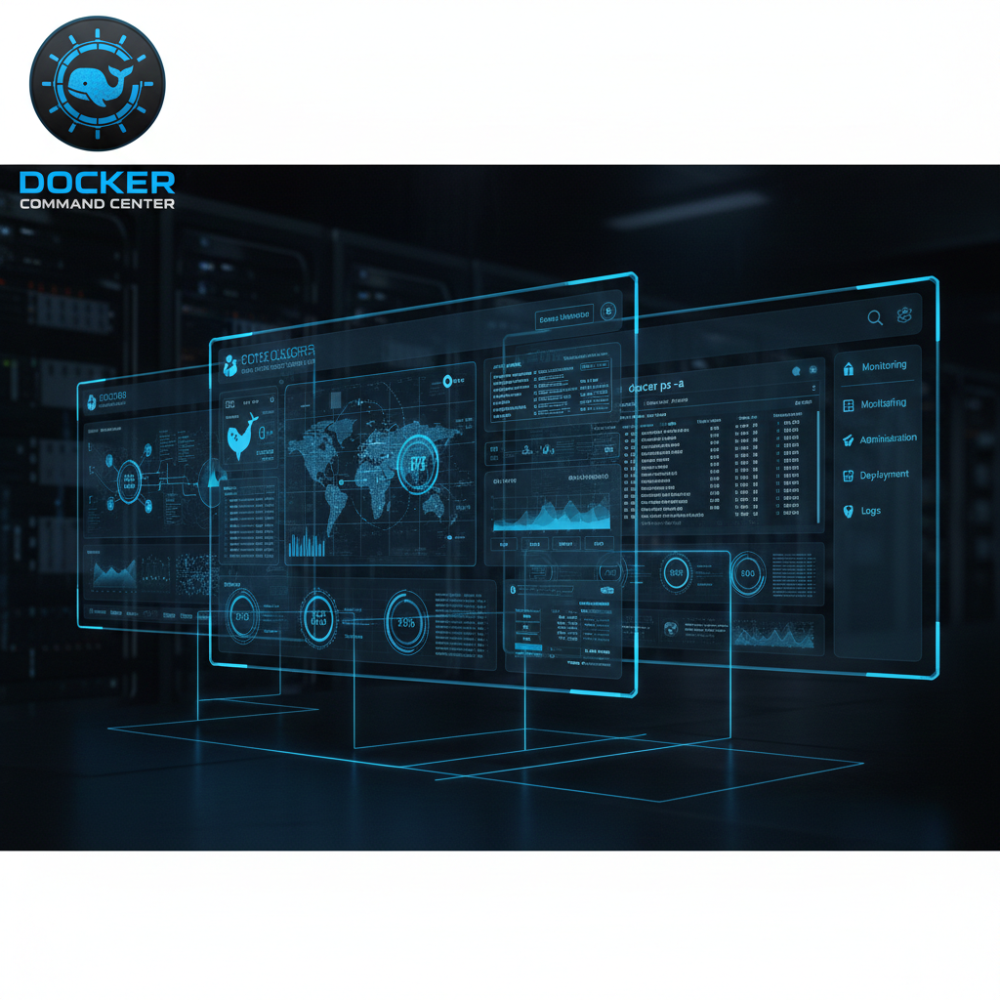

<p align="center">
  
</p>

<h1 align="center">Docker Command Center</h1>

<p align="center">
  <strong>A next-generation Docker management platform — CLI-first, zero lock-in, real-time control.</strong>
</p>

<p align="center">
  
  
  
  
  
  
</p>

<p align="center">
  
</p>

---

## Overview

Docker Command Center (DCC) solves the friction points of traditional tools like Portainer and Docker Desktop with a **single binary** that embeds the full React frontend. No Docker container required to run the manager itself — just build and go.

**Key differentiators:**
- Single self-contained binary (~14 MB)
- Zero proprietary database — everything syncs with your `docker-compose.yml` files
- Real-time WebSocket updates across all 21 UI pages
- AI-ready via Model Context Protocol (MCP) Gateway
- CVE security scanning via Trivy integration
- Built-in RBAC + audit logging

---

## Quick Start

### Prerequisites

| Tool | Version |
|------|---------|
| Docker Engine | 20.10+ |
| Go | 1.24+ |
| Node.js | 18+ |

### Build & Run

```bash
# Clone
git clone https://github.com/paulmmoore3416/docker-command-center.git
cd docker-command-center

# Build (frontend + backend → single binary)
make build

# Run
./dcc
```

Open **http://localhost:9876** in your browser.

### One-liner install (after cloning)

```bash
make install   # builds and installs to /usr/local/bin/dcc
dcc            # run from anywhere
```

---

## GCP Deployment (Recommended)

> One-time setup, then `git pull && make install` for every update.

### 1. Provision a GCP VM

```bash
gcloud compute instances create dcc-server \
  --machine-type=e2-medium \
  --image-family=debian-12 \
  --image-project=debian-cloud \
  --boot-disk-size=20GB \
  --tags=http-server,https-server
```

### 2. Open port 9876

```bash
gcloud compute firewall-rules create allow-dcc \
  --allow tcp:9876 \
  --target-tags=http-server \
  --description="Docker Command Center UI"
```

### 3. SSH into VM and install dependencies

```bash
gcloud compute ssh dcc-server

# Install Docker
curl -fsSL https://get.docker.com | sh
sudo usermod -aG docker $USER

# Install Go 1.24
wget https://go.dev/dl/go1.24.0.linux-amd64.tar.gz
sudo tar -C /usr/local -xzf go1.24.0.linux-amd64.tar.gz
echo 'export PATH=$PATH:/usr/local/bin' >> ~/.bashrc && source ~/.bashrc

# Install Node.js 20
curl -fsSL https://deb.nodesource.com/setup_20.x | sudo -E bash -
sudo apt-get install -y nodejs
```

### 4. Clone and deploy

```bash
git clone https://github.com/paulmmoore3416/docker-command-center.git
cd docker-command-center
make install
dcc
```

### 5. Subsequent updates

```bash
cd docker-command-center
git pull
make install
# Restart dcc (kill old process, start new one)
```

### Optional: Run as a systemd service

```bash
sudo tee /etc/systemd/system/dcc.service > /dev/null <<EOF
[Unit]
Description=Docker Command Center
After=docker.service
Requires=docker.service

[Service]
ExecStart=/usr/local/bin/dcc
Restart=always
User=$USER
Environment=DCC_API_KEY=your-secret-key-here

[Install]
WantedBy=multi-user.target
EOF

sudo systemctl daemon-reload
sudo systemctl enable --now dcc
```

---

## Features

### Core Features

| # | Feature | Description |
|---|---------|-------------|
| 1 | **Ghost Mode** | Bidirectional sync between UI and `docker-compose.yml` — no proprietary DB |
| 2 | **Smart Restarts** | Dependency-aware orchestration with health-check propagation |
| 3 | **Ephemeral Environments** | One-click branch stacks from Git with TTL-based auto-cleanup |
| 4 | **Visual Networking** | Live traffic canvas with container communication visualization |
| 5 | **Resource Guardrails** | CPU/RAM/Disk threshold alerts, volume file explorer, cleanup suggestions |
| 6 | **Container Archaeology** | Historical state tracking, time-travel debugging, config diff viewer |

### Advanced Features

| # | Feature | Description |
|---|---------|-------------|
| 7 | **Drift Detection** | Real-time config vs. running comparison (30s intervals), root/capability alerts |
| 8 | **CVE Security Auditing** | Trivy integration — scan all containers, hardening recommendations, export reports |
| 9 | **Sandboxed Execution** | Seccomp profiles (strict/moderate/permissive), AppArmor-ready, resource limits |
| 10 | **MCP Gateway** | AI-friendly JSON-RPC with 12 Docker operations — Claude/GPT integration ready |
| 11 | **Log Aggregation** | Unified log stream, real-time grep, watchword alerts, level-based filtering |
| 12 | **Dependency Topology** | Nodes-and-lines graph with health-aware colors and real-time updates |

### v2.2.0 Enhancements

- **Security Page**: JSON/CSV/Print export of CVE scan results
- **Logs Page**: Copy-to-clipboard, TXT/JSON export, color-coded severity badges, virtualized rendering
- **Dashboard**: Real-time CPU/Memory/Network metrics cards + area chart (5s refresh)
- **Networks Page**: Network stats (total/bridge/overlay/connected), container network table
- **Backend**: Syntax fixes in Docker client, topology graph metrics optimization

---

## Architecture

```
┌─────────────────────────────────────────────┐
│              DCC Binary (~14 MB)             │
│                                              │
│  ┌─────────────┐    ┌─────────────────────┐ │
│  │  Go Backend │◄──►│  React/TS Frontend  │ │
│  │  (port 9876)│    │  (embedded in bin)  │ │
│  └──────┬──────┘    └─────────────────────┘ │
│         │                                    │
│  ┌──────▼──────────────────────────────────┐│
│  │         Internal Modules                ││
│  │  docker/  drift/  security/  logs/      ││
│  │  sandbox/ mcp/    proxy/     audit/     ││
│  │  auth/    filewatch/ websockets/        ││
│  └─────────────────────────────────────────┘│
└─────────────────────────────────────────────┘
         │
         ▼
   Docker Engine (unix socket)
```

**Tech Stack:**

| Layer | Technology |
|-------|-----------|
| Backend | Go 1.24.0 |
| Frontend | React 18.2.0 + TypeScript 5.3.3 |
| Build | Vite 5.0.8 |
| Real-time | Gorilla WebSocket |
| Routing | Gorilla Mux |
| Charts | Recharts 2.10.0 |
| Graphs | ReactFlow 11.11.4 |
| Editor | Monaco Editor 4.6.0 |
| File Watch | fsnotify 1.7.0 |
| Docker SDK | v25.0.0 |

---

## API Reference

All endpoints are under `/api` and support optional RBAC via `X-API-Key`, `X-Role`, and `X-User` headers.

| Endpoint | Method | Permission | Description |
|----------|--------|-----------|-------------|
| `/api/containers` | GET | read | List all containers |
| `/api/containers/{id}/start` | POST | write | Start container |
| `/api/containers/{id}/logs` | GET | read | Stream container logs |
| `/api/compose/deploy` | POST | write | Deploy compose stack |
| `/api/drift` | GET | read | Get drift report |
| `/api/security/scan/all` | POST | write | Scan all images for CVEs |
| `/api/mcp/execute` | POST | write | Execute MCP tool |
| `/api/logs/aggregated` | GET | read | Get aggregated logs |
| `/api/audit` | GET | admin | Read audit trail |
| `/api/ws` | WS | — | Real-time WebSocket stream |

Full API: 50+ endpoints covering containers, compose, networks, volumes, environments, proxies, stacks, templates, updates, security, sandbox, MCP, logs, and audit.

---

## Authentication & Security

Set `DCC_API_KEY` environment variable to enable API key enforcement:

```bash
export DCC_API_KEY=your-secure-key
dcc
```

**RBAC Roles:**

| Role | Permissions |
|------|-------------|
| `viewer` | GET endpoints only |
| `operator` | GET + POST/PUT/DELETE |
| `admin` | All operations + audit log |

Pass role via `X-Role` header. Audit trail written to `/tmp/dcc-audit.log` and accessible at `/api/audit` (admin only).

---

## Development

```bash
# Frontend hot-reload dev server (port 5173)
make dev-frontend

# Backend with live reload
make dev-backend

# Full production build
make build

# Clean all artifacts
make clean
```

---

## Project Structure

```
docker-command-center/
├── assets/                  # Branding images
├── cmd/dcc/main.go          # Entry point + all API routes (300 lines)
├── internal/
│   ├── audit/               # Audit trail logging
│   ├── auth/                # API key + RBAC middleware
│   ├── docker/              # Docker SDK wrapper (1,377 lines)
│   ├── drift/               # Config drift detection
│   ├── filewatch/           # Bidirectional file sync
│   ├── logs/                # Log aggregation & streaming
│   ├── mcp/                 # Model Context Protocol gateway
│   ├── proxy/               # Reverse proxy manager
│   ├── sandbox/             # Seccomp sandboxed execution
│   ├── security/            # Trivy CVE scanner
│   └── websockets/          # Real-time WebSocket hub
├── frontend/
│   └── src/
│       ├── pages/           # 21 UI pages
│       ├── components/      # Shared components
│       └── hooks/           # Custom React hooks
├── compose/                 # Example docker-compose templates
├── Makefile                 # Build automation
└── go.mod                   # Go dependencies
```

---

## License

MIT — see [LICENSE](LICENSE)

---

<p align="center">
  Built with Go + React &nbsp;|&nbsp; Port 9876 &nbsp;|&nbsp; Version 2.2.0
</p>
